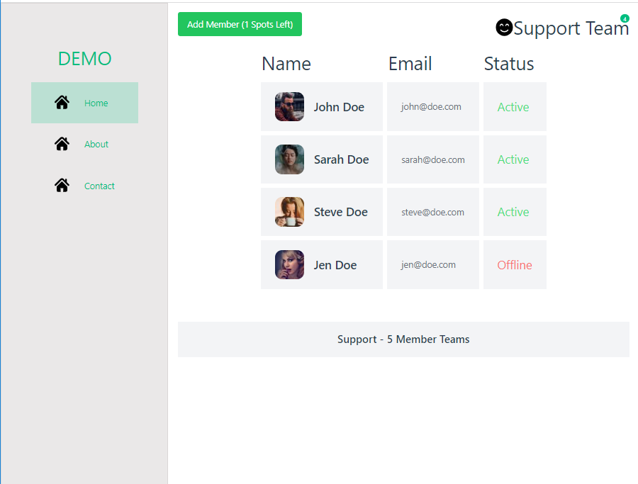
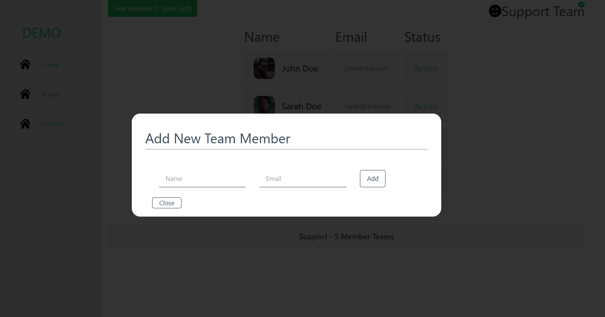
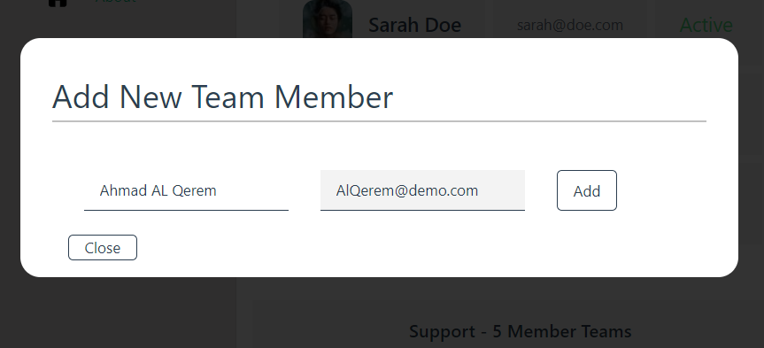
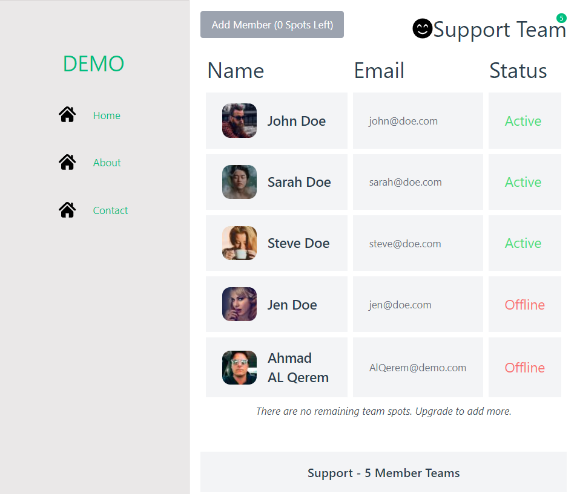

# Chapter - 8
* Code Organization (Build Dynamic Page)
* Build and Seed a Team Store ( Pinia Store)
* Build a Modal Component
* Two Ways to Transition
* Teleporting

## Images 
### Home Page 

### The Modal

## Adding New Team Member 

